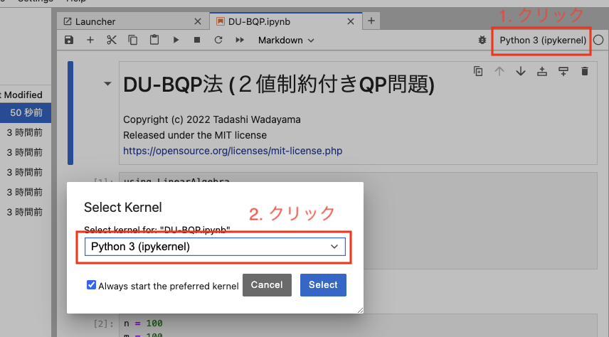
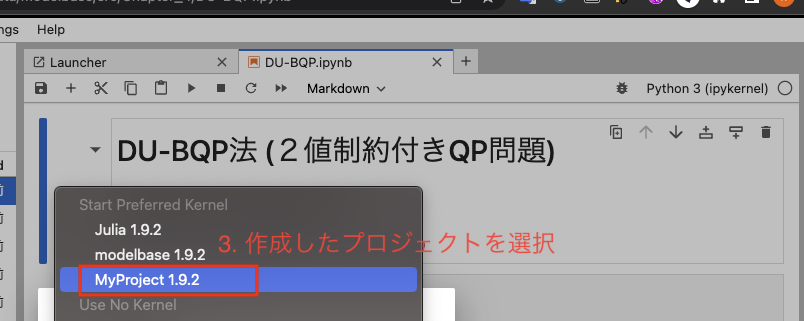

## モデルベース深層学習と深層展開」

書籍 URL: https://www.morikita.co.jp/books/mid/085731  
公式 GitHub URL: https://github.com/wadayama/DU-Book/tree/main

- Julia version 1.8.2
- Flux version 0.13.6
- Zygote 0.6.49

```
# julia 起動
$ julia

# pkg に移動
julia > ]

# 仮想環境の作成
pkg > generate MyProject

# 仮想環境のアクティベート
pkg > activate MyProject

# BackSpaceキーでパッケージモードから離脱

# IJulia 起動
julia > using IJulia

# IJulia.installkernel コマンドで新規 kernel を追加
julia > IJulia.installkernel("MyProjet", "--project=/各々の環境でフルパス指定/MyProject")

# 必要なパッケージのインストール
instantiate

# jupyter lab 起動
jupyterlab()
```

- jupyter lab 起動後、作成した Project のカーネルに切り替える




- Julia のインストール(M1 Mac)および jupyter lab の起動
  - [（備忘録）M1 Mac に Julia をインストールし、Jupyter で起動する方法](https://qiita.com/shyu_manabe/items/3978c1ef5d96d4e9dcef)
  - [Julia を Jupyter Lab で使う](https://leadinge.co.jp/julialang/2022/04/06/jupyterlab/#toc3)
- [Julia のプロジェクトと環境](https://qiita.com/mametank/items/9fc1c9227303d6ca304b)
- jupyter のカーネルに Project を追加
  - [Jupyter でプロジェクトを指定して Julia カーネル追加](https://stat-you1025.blogspot.com/2020/08/jupyter-julia.html)
- GPU の有無で処理を分ける
  - [Scenario 2: GPU is optional](https://cuda.juliagpu.org/stable/installation/conditional/#Scenario-2:-GPU-is-optional)
- [レイヤーの型変換]
  - [Flux.jl で量子力学](https://qiita.com/cometscome_phys/items/65048a702b54826b19d6#%E3%83%8B%E3%83%A5%E3%83%BC%E3%83%A9%E3%83%AB%E3%83%8D%E3%83%83%E3%83%88%E3%83%AF%E3%83%BC%E3%82%AF%E3%81%AB%E3%82%88%E3%82%8B%E5%9F%BA%E5%BA%95%E3%82%A8%E3%83%8D%E3%83%AB%E3%82%AE%E3%83%BC%E6%8E%A2%E7%B4%A2)
- Flux で loss に NaN が出る
  - [How come Flux.jl’s network parameters go to NaN?](https://discourse.julialang.org/t/how-come-flux-jls-network-parameters-go-to-nan/16439)
  - [Flux.jl vanilla ANN loss goes to NaN with mini batch](https://discourse.julialang.org/t/flux-jl-vanilla-ann-loss-goes-to-nan-with-mini-batch/25511)
